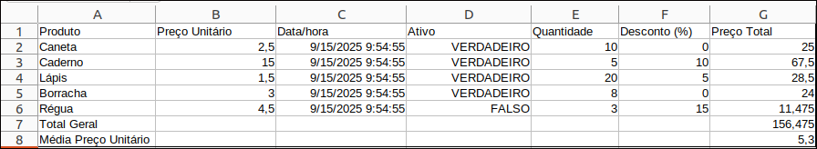

# Feature spec

Sensedia Integrations uses Apache Camel components and EIPs to build integration flows.
The **Marshal** and **Unmarshal** EIPs enable interoperability between systems by transforming data across different format types.

The excerpt below introduces the **Custom** format type, which allows users to process Excel spreadsheets within an integration flow using the Marshal/Unmarshal EIPs.

## Marshal/Unmarshal

Marshal and Unmarshal are fundamental processes for data manipulation, enabling  interoperability between systems.

import Tabs from '@theme/Tabs';
import TabItem from '@theme/TabItem';

<Tabs>
  <TabItem value="marshal" label="Marshal" default>
    Marshal is used in the process of transforming data from Camel's internal format into a standardized external format, such as JSON, XML, CSV, or others. 
    
    This conversion is essential to integrate the flow with external systems, send messages to APIs, or store information in files in a structured way.
  </TabItem>
  <TabItem value="unmarshal" label="Unmarshal">
    Unmarshal is used to the reverse process, where data received in an external format (e.g., JSON, XML, CSV) is converted into the internal format used by Camel. 
    
    This  step is necessary for messages to be processed, handled, or routed within Camel's 
integration flow.
  </TabItem>
</Tabs>

### Custom 

In the list of available data format types in **Data Format Type**, there is the **Custom** option.

With it, you can use **Excel** as a reference, allowing the integration flow to process files in `.xls` and `.xlsx` formats.

This data format will convert the rows of the specified spreadsheet into an array of JSON objects.  
The JSON object generated for each cell will contain, in addition to the value, metadata about the data type. 

:::note[NOTE] 
Spreadsheet visual styles (cell color, font color, bold, borders, and others) are not imported.
:::

To use the component, consider these guidelines:

- The setHeader `SensediaExcelFormat` indicates whether the file is `.xls` or `.xlsx`.  
  - If the value provided is different, the component will throw an error.
  - If the setHeader is not sent, `.xlsx` will be assumed by default.

- The setHeader `SensediaExcelSheetNames` provides a list of sheet names, separated by commas.  
  - Only the sheets listed in the setHeader will be processed.
  - If any listed sheet does not exist in the file, it will be ignored.

- If the setHeader `SensediaExcelSheetNames` exists but none of the names match a sheet in the file, the component will throw an error.

- The use of formulas is allowed. However, if the formula is incorrect, the cell in Excel will indicate an error.

### JSON Format

After converting an Excel file to JSON, the data is organized as shown in the JSON Schema below:

```json title="JSON Schema"
{
  "type": "object",
  "$schema": "https://json-schema.org/draft/2020-12/schema",
  "title": "Excel spreadsheet data schema",
  "description": "Schema for a data structure representing one or more spreadsheets with rows and cells.",
  "properties": {
    "sheets": {
      "description": "An array containing data for each sheet",
      "type": "array",
      "items": {
        "type": "object",
        "properties": {
          "name": {
            "description": "The name of the sheet.",
            "type": "string"
          },
          "rows": {
            "description": "The rows within a single sheet",
            "type": "array",
            "items": {
              "type": "object",
              "properties": {
                "cells": {
                  "description": "The rows within a single row",
                  "type": "array",
                  "items": {
                    "type": "object",
                    "properties": {
                      "v": {
                        "description": "The value of the cell. Can be a string, a number, or a boolean.",
                        "oneOf": [
                          { "type": "string" },
                          { "type": "number" },
                          { "type": "boolean" }
                        ]
                      },
                      "addr": {
                        "description": "The address of the cell (e.g., 'A1').",
                        "type": "string"
                      },
                      "type": {
                        "description": "The data type of the cell.",
                        "type": "string",
                        "enum": [
                          "str",
                          "num",
                          "bool",
                          "blank",
                          "formula"
                        ],
                        "default": "str"
                      },
                      "fmt": {
                        "description": "The formatting string for the cell's value.",
                        "type": "string",
                        "default": "General"
                      }
                    },
                    "required": [
                      "addr"
                    ],
                    "additionalProperties": false
                  }
                }
              },
              "required": [
                "cells"
              ],
              "additionalProperties": false
            }
          }
        },
        "required": [
          "name",
          "rows"
        ],
        "additionalProperties": false
      }
    }
  },
  "required": [
    "sheets"
  ],
  "additionalProperties": false
}
```

### Excel vs. JSON

Now, compare a spreadsheet with its version in JSON format:

**Excel**



**JSON**

```json title="Spreadsheet content in JSON format"
{
  "sheets": [
    {
      "name": "Sheet1",
      "rows": [
        {
          "cells": [
            {
              "v": "Product",
              "addr": "A1"
            },
            {
              "v": "Unit Price",
              "addr": "B1"
            },
            {
              "v": "Date/time",
              "addr": "C1"
            },
            {
              "v": "Active",
              "addr": "D1"
            },
            {
              "v": "Quantity",
              "addr": "E1"
            },
            {
              "v": "Discount (%)",
              "addr": "F1"
            },
            {
              "v": "Total Price",
              "addr": "G1"
            }
          ]
        },
        {
          "cells": [
            {
              "v": "Pen",
              "addr": "A2"
            },
            {
              "type": "num",
              "v": 2.5,
              "addr": "B2"
            },
            {
              "type": "num",
              "v": 45915.4131373611,
              "addr": "C2",
              "fmt": "m/d/yyyy\\ h:mm:ss"
            },
            {
              "type": "bool",
              "v": true,
              "addr": "D2",
              "fmt": "\"TRUE\";\"TRUE\";\"FALSE\""
            },
            {
              "type": "num",
              "v": 10,
              "addr": "E2"
            },
            {
              "type": "num",
              "v": 0,
              "addr": "F2"
            },
            {
              "type": "num",
              "v": 25,
              "addr": "G2"
            }
          ]
        },
        {
          "cells": [
            {
              "v": "Notebook",
              "addr": "A3"
            },
            {
              "type": "num",
              "v": 15,
              "addr": "B3"
            },
            {
              "type": "num",
              "v": 45915.4131373611,
              "addr": "C3",
              "fmt": "m/d/yyyy\\ h:mm:ss"
            },
            {
              "type": "bool",
              "v": true,
              "addr": "D3",
              "fmt": "\"TRUE\";\"TRUE\";\"FALSE\""
            },
            {
              "type": "num",
              "v": 5,
              "addr": "E3"
            },
            {
              "type": "num",
              "v": 10,
              "addr": "F3"
            },
            {
              "type": "num",
              "v": 67.5,
              "addr": "G3"
            }
          ]
        },
        {
          "cells": [
            {
              "v": "Pencil",
              "addr": "A4"
            },
            {
              "type": "num",
              "v": 1.5,
              "addr": "B4"
            },
            {
              "type": "num",
              "v": 45915.4131373611,
              "addr": "C4",
              "fmt": "m/d/yyyy\\ h:mm:ss"
            },
            {
              "type": "bool",
              "v": true,
              "addr": "D4",
              "fmt": "\"TRUE\";\"TRUE\";\"FALSE\""
            },
            {
              "type": "num",
              "v": 20,
              "addr": "E4"
            },
            {
              "type": "num",
              "v": 5,
              "addr": "F4"
            },
            {
              "type": "num",
              "v": 28.5,
              "addr": "G4"
            }
          ]
        },
        {
          "cells": [
            {
              "v": "Eraser",
              "addr": "A5"
            },
            {
              "type": "num",
              "v": 3,
              "addr": "B5"
            },
            {
              "type": "num",
              "v": 45915.4131373611,
              "addr": "C5",
              "fmt": "m/d/yyyy\\ h:mm:ss"
            },
            {
              "type": "bool",
              "v": true,
              "addr": "D5",
              "fmt": "\"TRUE\";\"TRUE\";\"FALSE\""
            },
            {
              "type": "num",
              "v": 8,
              "addr": "E5"
            },
            {
              "type": "num",
              "v": 0,
              "addr": "F5"
            },
            {
              "type": "num",
              "v": 24,
              "addr": "G5"
            }
          ]
        },
        {
          "cells": [
            {
              "v": "Ruler",
              "addr": "A6"
            },
            {
              "type": "num",
              "v": 4.5,
              "addr": "B6"
            },
            {
              "type": "num",
              "v": 45915.4131373611,
              "addr": "C6",
              "fmt": "m/d/yyyy\\ h:mm:ss"
            },
            {
              "type": "bool",
              "v": false,
              "addr": "D6",
              "fmt": "\"TRUE\";\"TRUE\";\"FALSE\""
            },
            {
              "type": "num",
              "v": 3,
              "addr": "E6"
            },
            {
              "type": "num",
              "v": 15,
              "addr": "F6"
            },
            {
              "type": "num",
              "v": 11.475,
              "addr": "G6"
            }
          ]
        },
        {
          "cells": [
            {
              "v": "General Total",
              "addr": "A7"
            },
            {
              "type": "num",
              "v": 156.475,
              "addr": "G7"
            }
          ]
        },
        {
          "cells": [
            {
              "v": "Average Unit Price",
              "addr": "A8"
            },
            {
              "type": "num",
              "v": 5.3,
              "addr": "G8"
            }
          ]
        }
      ]
    }
  ]
}
```
### Code example

This flow exposes a REST endpoint (`GET /teste-excel`) that, when called, downloads an Excel file from an SFTP server, converts its content to JSON, and returns the result.

Here is the flow in detail:  

1. Receives the REST request.
1. Logs the start of the file download via SFTP.
1. Downloads the file from the SFTP server.
1. Logs the completion of the download and the conversion to JSON.
1. Converts the content to `byte[]`.
1. Defines in the setHeader the sheets to be processed (`test1,test2`).
1. Uses `marshal` with the `excel` (custom) data format to transform the file into JSON.
1. Defines the `Content-Type` setHeader to `application/json` for the response.

```yaml title="Example of flow using the custom component"

- from:
    uri: rest:get:/teste-excel
    steps:
      - log:
          message: "Starting file download via SFTP."
      - pollEnrich:
          expression:
            simple: "sftp:eu-central-1.sftpcloud.io:22/download?username={{user}}&password={{pass}}&passiveMode=true&delete=false&fileName={{file}}&binary=true&knownHostsFile=/dev/null&strictHostKeyChecking=no"
      - log:
          message: "Download concluded. Converting to JSON."
      - convertBodyTo:
          type: byte[]
      - setHeader:
          name: SensediaExcelSheetNames
          expression:
            constant:
              expression: test1,test2
      - marshal:
          custom:
            ref: excel
      - setHeader:
          name: Content-Type
          constant: application/json
```

:::important[IMPORTANT] 
Excel can also be used in flows with the **EIP unmarshal**.

- In this case, the **addr** field in the input JSON will not be considered.
- Rows and columns will be built based solely on the order of rows and cells.
- The result of the unmarshal will be a byte[].
:::