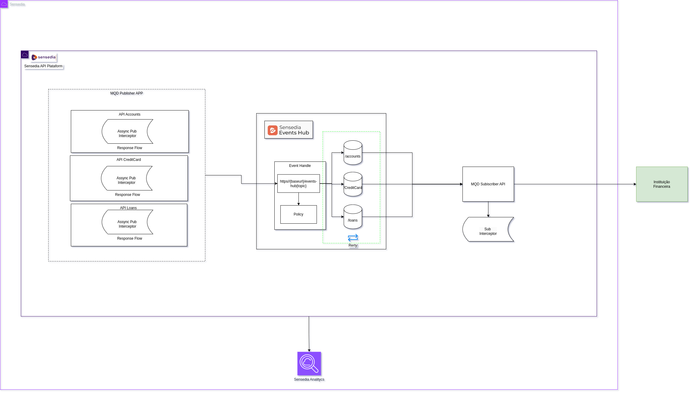
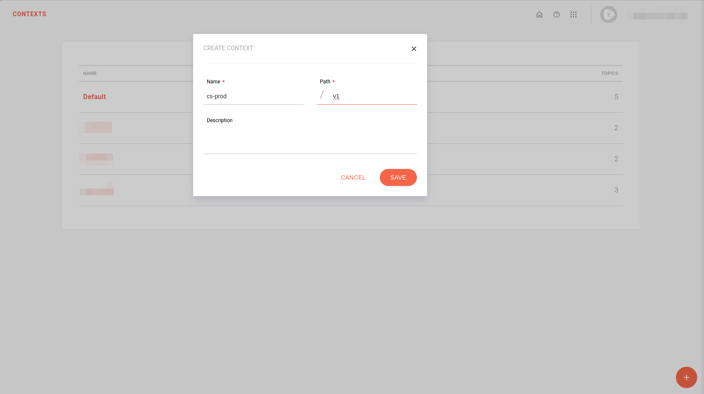
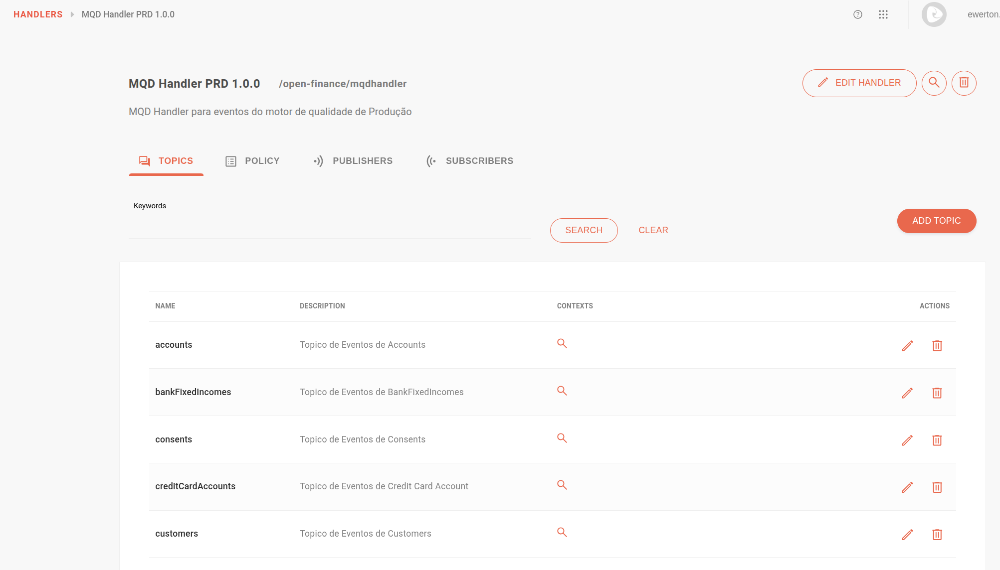
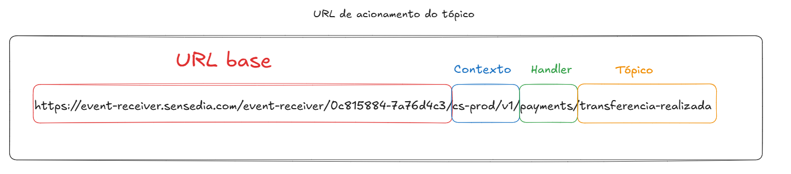
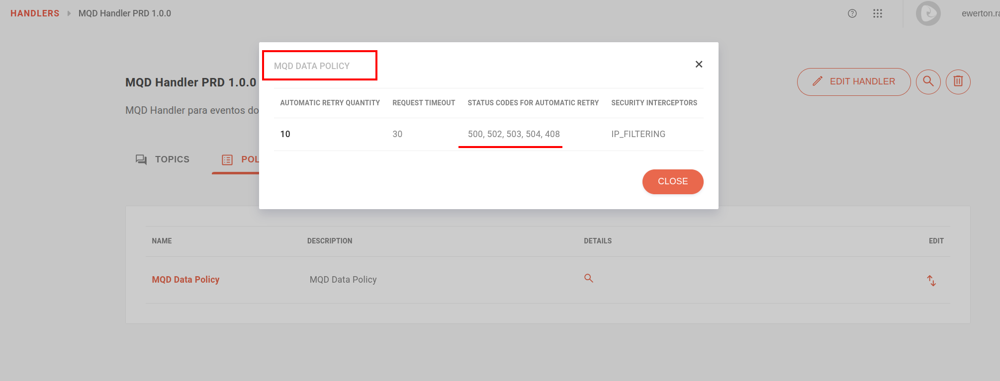
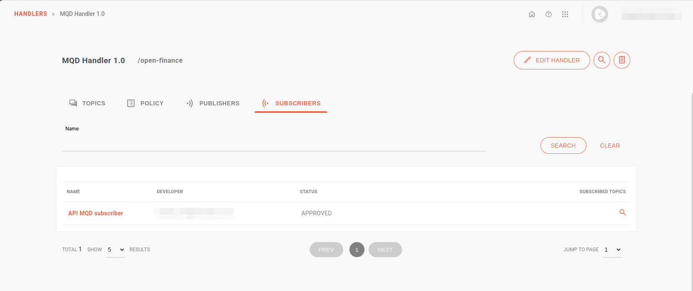
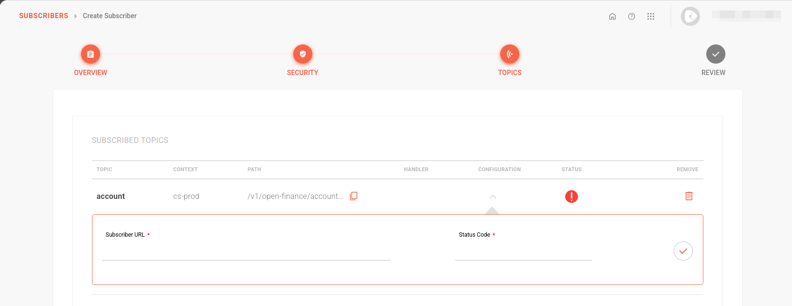
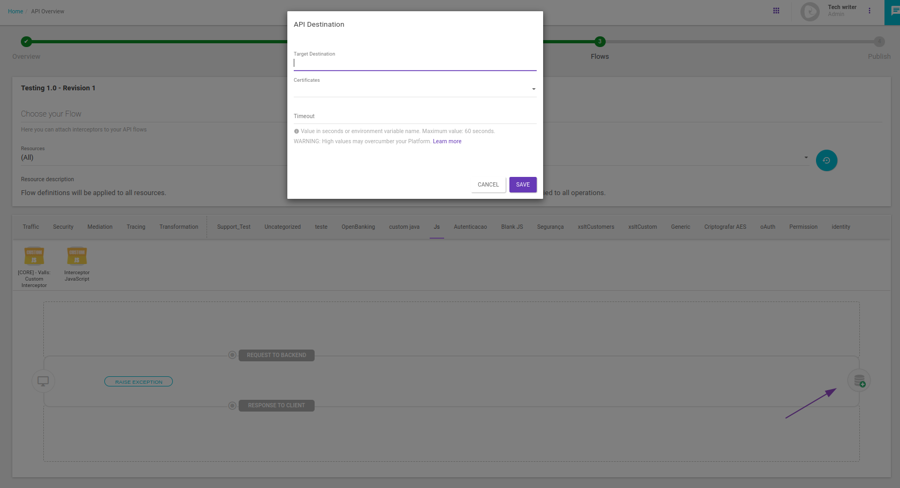
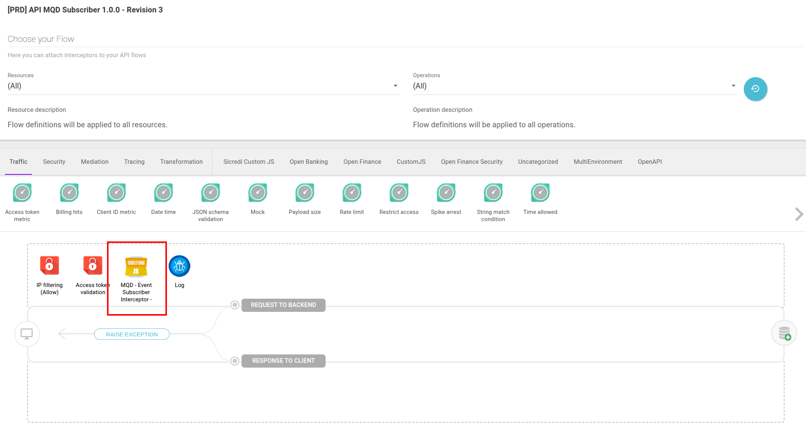
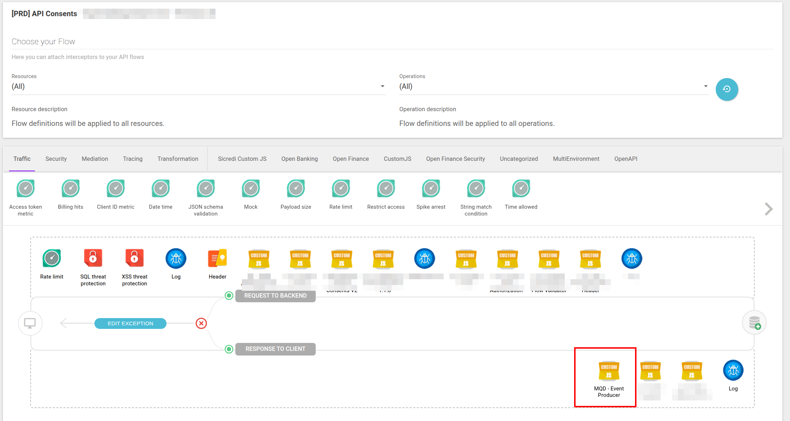

# Tutorials

This tutorial was created to support a solution offered by Sensedia for its Open Finance customers in Brazil.

The solution helps institutions comply with Central Bank requirements by integrating two Sensedia products: API Platform and Events Hub.

The documentation is originally published at [Sensedia Docs | Open Finance | Data Quality Engine](https://docs.sensedia.com/en/open-finance-guide/Latest/mqd.html) 

## Data Quality Engine

**Data Quality Engine** (_Motor de Qualidade de Dados_ or _MQD_ in Portuguese) is the open-source tool that evaluates the quality of data shared among participants of [Open Finance](https://openfinancebrasil.atlassian.net/wiki/spaces/OF/pages/362578565/Motor+de+Qualidade+de+Dados), ensuring the integrity of the information.

Sensedia provides tools to facilitate integration between the **Sensedia API Platform**, **Events Hub**, and **MQD**, enabling efficient data processing.

The diagram illustrates this integration:



The diagram presents an Open Finance integration flow, where the **Sensedia API Platform** acts as the publisher of APIs eligible for MQD — such as accounts, cards, and loans.

Events generated by these APIs are asynchronously published to the **Sensedia Events Hub**, which consumes them, applies policies, classifies them, and forwards them via the MQD Subscriber API to the Financial Institution's proxy.

This process ensures efficient, secure, and controlled data delivery.

Below is the step-by-step guide for integration:

---

### Step 1: Configuring the Events Hub {#evh}

#### Context

1. Create a context, as shown in the image below:

   

   :::note[NOTE] 
   Consult more information on configuring [contexts](https://docs.sensedia.com/en/events-hub-guide/Latest/contexts.html) in the Events Hub. 
   :::

#### Handler

1. Create a *handler*, for example: **MQD Handler**.
2. In the **Topics** step:
   - Add client topics: `accounts`, `consents`, `creditCardAccounts`, etc. You must configure one topic for each API eligible for MQD.  
       
   - Enable the context in each topic by clicking the magnifying glass.

     > **Event publication URL**  
     >  
     > Each topic creates a publication URL, which must be configured in the Custom JS interceptor of the [data APIs](#data-api).  
     >  
     > See an example of a URL created by the Events Hub:  
     > 

3. In the **Policy** step:

* a. Create an **IP Filtering Validation** policy, specific to the outbound IPs of the Sensedia API Platform.

:::important[IMPORTANT] 
To check the IPs of the Sensedia API Platform, access the [Infrastructure Manager](https://docs.sensedia.com/en/api-management-guide/Latest/other-info/infrastructure-manager.html):  

* Once logged into the platform, append `/info` directly to the end of the URL, as shown below:  
```
https://manager-example.sensedia.com/api-management/info/
```
:::

* b. Fill in the delivery settings fields:
     * Retry count
     * Codes for automatic retries: `500`, `502`, `503`, `504`, `408`
     * Request timeout

Once registered, the information should appear as follows:



:::note[NOTE] 
   Consult more information on configuring [handlers](https://docs.sensedia.com/en/events-hub-guide/Latest/handlers.html) in the Events Hub.
:::

#### Subscriber

1. Create a subscriber for MQD, which will be the [MQD subscriber API](#mqd-subscriber-api).  
   
2. In the **Security** step:
   - Validate the key and create a static token for the subscriber (optional).
3. In the **Topics** step:
   - Select the MQD Handler and then select the client topics. Enable the **Publish** option.
   - Fill in the **Subscriber URL** field with the endpoint of the [MQD subscriber API](#mqd-subscriber-api).
   - Add the status code `200` in the corresponding field.

   

:::note[NOTE] 
If the API is inactive at the time of registration, the subscriber status will appear gray, but this does not mean it is inactive.  

Consult more information on configuring [subscribers](https://docs.sensedia.com/en/events-hub-guide/Latest/subscribers.html) in the Events Hub.
:::

---

### Step 2: Configuring the MQD subscriber API {#mqd-subscriber-api}

Configure an **MQD subscriber API** that will act as a proxy with the financial institution's environment.  
This API will be responsible for receiving data from the Events Hub and forwarding it to MQD.

When configuring this API:

1. In the [Resources](https://docs.sensedia.com/en/api-management-guide/Latest/apis/resources.html) step:
   - Add a resource, for example: `v1/report-data`.
2. In the [Flows](https://docs.sensedia.com/en/api-management-guide/Latest/apis/flows.html) step:
   - Insert the URL that will be the API's destination, which varies depending on the API to be exposed.  
     
   - Add the following interceptors:
     * **IP Filtering**: with the outbound IPs of the Events Hub (check the IPs with the support team).
     * **Access Token Validation**: the same inserted in the Events Hub.
     * **Custom JS**: will manipulate the header for MQD format. You can customize it for the client by removing some unnecessary headers.  

       Check the Custom JS interceptor in the API flow:  
       

       You can configure the JS interceptor as follows:

       ```javascript
       const scriptName = String("MQD - Event Subscriber Interceptor ");
       const scriptVersion = String("1.0.0");
       try {
           $call.tracer.trace(">Sensedia debug => Custom javascript: Name [ "+scriptName+" ] version [ "+scriptVersion+" ]." );
           var json = JSON.parse( $call.request.getBody().getString( "utf-8" ) );
           $request.setHeader("endpointName", json.mqd.endpointName);
           $request.setHeader("serverOrgId", json.mqd.serverOrgId);
           $request.setHeader("x-fapi-interaction-id", json.mqd.fapiInteractionId);

           delete json['mqd'];
           $call.request.getBody().setString( $json.stringify(json), "utf-8" );
           
           $call.request.getAllHeaders().remove("x-clientname-webhooks-signature");
           $call.request.getAllHeaders().remove("access-token");
       } catch (exception) {
           $call.tracer.trace("Exception message => " + exception.message + " <= in line => " + exception.stack);
           $console.debug(">sensedia => Exception", exception);
       }
       ```

:::note[NOTE] 
Consult more information on creating [APIs](https://docs.sensedia.com/en/api-management-guide/Latest/apis/creating-apis.html) in the Sensedia API Platform.
:::

---

### Step 3: Configuring the Custom JS interceptor in the flow of data APIs {#data-api}

In the Sensedia API Platform, select the data APIs eligible for MQD:

1. Add the Custom JS interceptor in the [Flows](https://docs.sensedia.com/en/api-management-guide/Latest/apis/flows.html) step.  
   If there is more than one API, place the interceptor once in each existing API.
2. In the **Resources** field, keep the "All" option.



You can configure the Custom JS interceptor as follows:

```javascript
const scriptName = String("MQD - Event Producer Interceptor");
const scriptVersion = String("1.1.0");

try {
    
    $call.tracer.trace(">Sensedia debug => Custom javascript: Name [ "+scriptName+" ] version [ "+scriptVersion+" ]." );
    $console.debug("responseStatusCode", $call.response.getStatus());

    if ($call.response.getStatus() == 200 && $call.request.getMethod() == "GET") {

        const url = String($call.request.getRequestedUrl().getPath());
        
        const apiName = extractApiNameByUrl(url);
        
        $console.debug("apiName", apiName);
        
        const mqdTopicUrl = String($call.environmentVariables.get('mqd-'+ apiName +'-topic-handler-url'));

        $console.debug("mqdTopicUrl", mqdTopicUrl);

        if(mqdTopicUrl) {
            
            let jsonResponse = JSON.parse( $call.response.getBody().getString("UTF-8") );
            
            jsonResponse.mqd = {};
            jsonResponse.mqd.endpointName = substituirPathPorPathId(url);
            jsonResponse.mqd.serverOrgId = $call.request.getHeader("x-organisation-id");
            jsonResponse.mqd.fapiInteractionId = $response.getHeader("x-fapi-interaction-id");
            
            const response =  $http.post(mqdTopicUrl, $call.response.getHeaders(), $json.stringify(jsonResponse));
            
            $console.debug("response", response.responseText);
            $console.debug("response status", response.getStatus());
            
            $call.tracer.trace("Custom javascript: Name [ "+scriptName+" ] version [ "+scriptVersion+" ].Envio para MQD Finalizado." );
            
        } else {
            $call.tracer.trace("Custom javascript: Name [ "+scriptName+" ] version [ "+scriptVersion+" ]. ATENCAO!  environmentVariable >'mqd-"+ apiName +"-topic-handler-url'< nao configurada! Ignorando envio para topico MQD." );
        }
    }
} catch (exception) {
    $call.tracer.trace("Exception message => " + exception.message + " <= in line => " + exception.stack);
    $console.debug(">sensedia => Exception", exception);
}

function substituirPathPorPathId(urlSearch) {

  function substituir(match, pathAnterior) {
      const pathId = pathAnterior.slice(0, -1) + 'Id';
      return '/' + pathAnterior + '/{'+pathId+'}';
  }
  let regex = /\/([^\/]+)\/([a-f0-9-]+)(?=\/|$)/g;

  if(apiName === "consents"){
    regex = /\/([^\/]+)\/(urn:[a-zA-Z0-9-]+:[a-f0-9-]+)(?=\/|$)/g;
  }
  
  const novaUrl = urlSearch.replace(regex, substituir);
  
  return novaUrl.match(/open-banking(.+)/)[1];
}

function extractApiNameByUrl(url) {
  const start = "open-banking/";
  const startIndex = url.indexOf(start);

  if (startIndex === -1) {
    return "";
  }

  const endIndex = url.indexOf("/", startIndex + start.length);
  if (endIndex === -1) {
    return url.substring(startIndex + start.length);
  }

  return url.substring(startIndex + start.length, endIndex);
}