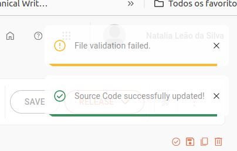

# UX writing

This page showcases examples of microcopy I created for the product’s interface.  
The messages were designed to guide users through key actions, provide clarity, and ensure a smooth experience when working with integration flows.  

You can explore the samples by category:  

- [Alerts](#alerts)  
- [Confirmation dialog](#confirmation-dialog)  
- [Toasts](#toasts)  
- [Tooltips](#tooltips)  

## Alerts

* **Errors in the Source Code**

  * **Context**: This page is where users build an integration flow. If the user saves the flow while there are errors, an alert message appears to indicate there are issues.

* **Creating a release before deployment**

  * **Context**: If the user makes changes to an integration flow and wants to deploy it, they must first save the updates and then create a release. Once the release is created, the flow is ready for deployment.  

## Confirmation dialog

* **Create release**

  * **Context**: When a user saves an integration flow, they must create a release to proceed with deployment. This confirmation dialog prompts the user to create the release.

* **Exiting without saving**

   * **Context**: If a user attempts to leave the screen without saving their integration flow, a confirmation dialog warns them that unsaved changes will be lost.

* **Delete "Choice"**

   * **Context**: Deleting a "Choice" step also removes all dependent steps that follow it, as they belong to the same structure. The dialog confirms this action.

* **Delete step**

   * **Context**: This page allows users to perform actions related to the integration flow based on its current status. One of the available actions is viewing the logs.

## Toasts

* **Saving the flow**
* **Validation failed**

  * **Context**: The user can save the integration flow at any time, even if it contains errors. When the flow is saved, the user is informed of the existing errors. Any validation issues are highlighted in a designated area, allowing the user to review and address them later.

## Tooltips

* **Configure data source environments**

   * **Context**: This page allows users to configure data sources that connect to their integration flows. 
In this section, users can choose to configure a single environment or both — staging and production.

* **View logs**

  * **Context**: This page lets users perform actions related to the integration flow, depending on its current status. One of the available actions is viewing the logs.

